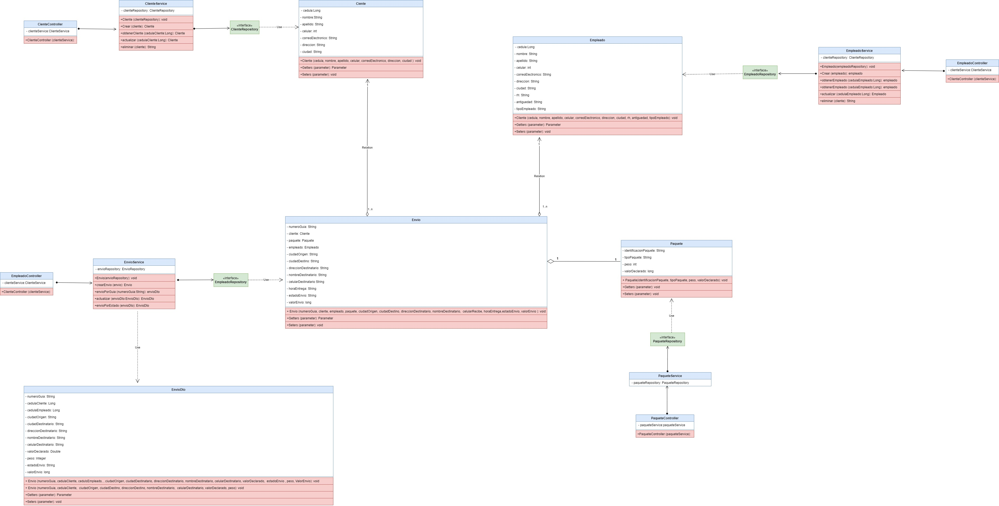
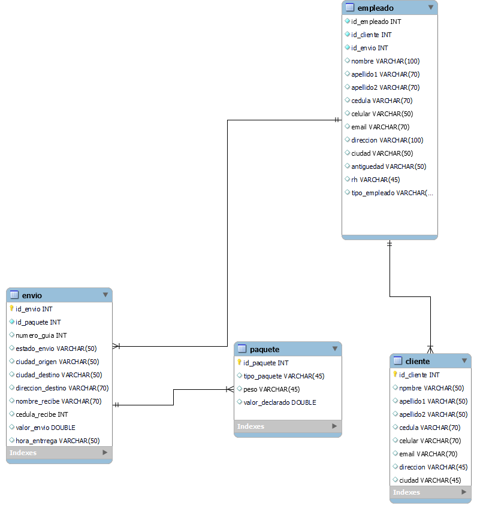

# Proyecto de Mensajería Y Envios

Este es un proyecto de mensajería express que utiliza Java y Spring para crear un sistema de seguimiento y gestión de envíos. El proyecto utiliza una base de datos MySQL con un modelo entidad-relación, y documentación en Swagger para especificar los endpoints de los microservicios. También utiliza el patrón de diseño DTO, pruebas unitarias con Mockito y JUni y está dividido en microservicios para Cliente, Empleado y Envío. La integración continua se realiza con GitHub y el despliegue se realiza en Google Cloud Platform.

El proyecto esta hecho principalmente con las siguientes tecnologías: 

<ol>
	<li>Java 
		
	</li>
    <li>My Sql 
		
	</li>
    <li>Git 
		
   </li>
   <li>Spring Boot 
		
   </li>
   <li>Spring Data 
		
   </li>
   <li>Spring Security 
		
   </li>
   <li>Junit 
		
   </li>
   <li>Swagger 
		
   </li>
   <li>Github 
		
   </li>
</ol>

La integración continua se implementó con Github Actions y el despliegue del microservicio se hizo en Google Cloud con app engine,
para explorar la documentación de este puede ingresar al siguiente enlace: 

### [https://flash-bazaar-385401.rj.r.appspot.com/swagger-ui/index.html#](https://flash-bazaar-385401.rj.r.appspot.com/swagger-ui/index.html#)


# Endpoints:

## Tabla de urls:

| URL                                                                                       | Funcion                   | Peticion |
|-------------------------------------------------------------------------------------------|---------------------------|----------|
| https://flash-bazaar-385401.rj.r.appspot.com/api/v1/cliente                               | Registrar cliente         | POST     |
| https://flash-bazaar-385401.rj.r.appspot.com/api/v1/cliente/{cedula}                      | Obtener info cliente      | GET      |
| https://flash-bazaar-385401.rj.r.appspot.com/api/v1/cliente/{cedula}                      | Eliminar cliente          | DELETE   |
| https://flash-bazaar-385401.rj.r.appspot.com/api/v1/empleado                              | Registrar empleado        | POST     |
| https://flash-bazaar-385401.rj.r.appspot.com/api/v1/empleado/{cedula}                     | Obtener info empleado     | GET      |
| https://flash-bazaar-385401.rj.r.appspot.com/api/v1/empleado/{cedula}                     | Eliminar empleado         | DELETE   |
| https://flash-bazaar-385401.rj.r.appspot.com/api/v1/envios/{estadoEnvio}/{cedulaEmpleado} | Filtrar envios por estado | GET      |
| https://flash-bazaar-385401.rj.r.appspot.com/api/v1/envio                                 | Registrar un envio        | POST     |
| https://flash-bazaar-385401.rj.r.appspot.com/api/v1/envio                                 | Actualizar estado envio   | PATCH    |
| https://flash-bazaar-385401.rj.r.appspot.com/api/v1/envio/{numGuia}                       | Obtener información envio | GET      |

### /api/v1/cliente  (POST. Registrar un cliente.)
  El body de la solicitud recibe los siguientes parametros: 
  ```java {.highlight .highlight-source-java .bg-black}
    {
    "cedula": Long,
    "nombre": String,
    "apellido": String,
    "celular": String,
    "correoElectronico": String,
    "direccion": String,
    "ciudad": String,
    }
```
  Ejemplo de la petición:
  ```java {.highlight .highlight-source-java .bg-black}
 {
  "cedula": 9876543210,
  "nombre": "María",
  "apellidos": "García Jiménez",
  "celular": "3187654321",
  "correoElectronico": "maria.garcia@example.com",
  "direccion": "Carrera 34 # 56 - 78",
  "ciudad": "Medellín"
}
```

### /api/v1/cliente/{cedula}  (DELETE .Eliminar cliente por su cedula.)
  La petición recibe el numero de cedula de un cliente y retorna un String confirmando que la operación
  ocurrió de manera satisfactoria siempre que es estado de la petición sea 200.
```java {.highlight .highlight-source-java .bg-black}
    Se elimino correctamente
```

### /api/v1/cliente/{{cedula}}  (GET. Obtener cliente por su cedula.)
  La petición recibe el numero de cedula de un cliente y retorna la información asociada a este cliente.
  
  Ejemplo de la respuesta:
  ```java {.highlight .highlight-source-java .bg-black}
 {
  "cedula": 9999999999,
  "nombre": "Ana",
  "apellidos": "Martínez Pérez",
  "celular": "3177777777",
  "correoElectronico": "ana.martinez@example.com",
  "direccion": "Calle 10 # 20 - 30",
  "ciudad": "Cali"
}
  ```

### /api/v1/empleado  (POST. Registrar empleado.)

  El body de la solicitud recibe los siguientes parametros:
  NOTA: El tipo de empleado solo puede ser COORDINADOR, REPARTIDOR O CONDUCTOR
    
  ```java {.highlight .highlight-source-java .bg-black}
	    {
	    "cedula": Long,
	    "nombre": String,
	    "apellidos": String,
	    "celular": String,
	    "correoElectronico": String,
	    "direccion": String,
	    "ciudad": String,
	    "antiguedad": String,
	    "rh": "string",
	    "tipoEmpleado": "string"
	    }
  ```
  
  Ejemplo de la petición:
  
  ```java {.highlight .highlight-source-java .bg-black}
  {
    "cedula": 9876543210,
    "nombre": "María",
    "apellidos": "García",
    "celular": "3109876543",
    "correoElectronico": "maria.garcia@example.com",
    "direccion": "Calle 67 # 89 - 10",
    "ciudad": "Medellín",
    "antiguedad": "2 años",
    "rh": "A+",
    "tipoEmpleado": "CONDUCTOR"
  }
```

### /api/v1/empleado/{{cedula}}  (DELETE. Eliminar empleado por su cedula.)
  La petición recibe el numero de cedula de un empleado y retorna un String confirmando que la operación
  ocurrió de manera satisfactoria siempre que es estado de la petición sea 200.
    
  ```java {.highlight .highlight-source-java .bg-black}
      Se elimino correctamente
  ```

### /api/v1/empleado/{{cedula}}  (GET. Obtener empleado por su cedula.)
  La petición recibe el numero de cedula de un empleado y retorna la información asociada a este empleado.
    
  Ejemplo de la respuesta:
 ```java {.highlight .highlight-source-java .bg-black}
  {
    "cedula": 2345678901,
    "nombre": "Pedro",
    "apellidos": "Rojas",
    "celular": "3152345678",
    "correoElectronico": "pedro.rojas@example.com",
    "direccion": "Avenida 12 # 34 - 56",
    "ciudad": "Cali",
    "antiguedad": "1 año",
    "rh": "B+",
    "tipoEmpleado": "REPARTIDOR"
  }
```

### /api/v1/envio  (POST. Registrar envio.)

  El body de la solicitud recibe los siguientes parametros:
    
  ```java {.highlight .highlight-source-java .bg-black}
 {
    "cedulaCliente":Integer,
    "ciudadOrigen":String,
    "ciudadDestino":String,
    "direccionDestino":String,
    "nombreDestinatario":String,
    "celularDestinatario":String,
    "valorDeclaradoPaquete":Double,
    "peso":Integer
}
  ```
  Y responde con el numero guia y el estado del envio:
  ```java {.highlight .highlight-source-java .bg-black}
   {
      numeroGuia=String
      estadoEnvio=String
   }
 ``` 
  Ejemplo de la petición:
  
  ```java {.highlight .highlight-source-java .bg-black}
{
  "cedulaCliente":1234567890 ,
  "ciudadOrigen": "Barranquilla",
  "ciudadDestino": "Bogota",
  "direccionDestino": "Carrera 34 # 56 - 78",
  "celularDestinatario": "3112622933",
  "nombreDestinatario": "Juan Jimenez",
  "valorDeclarado": 19000,
  "peso": 3,
}
```

```java {.highlight .highlight-source-java .bg-black}
   Numero De Guia: AUA4900W69  Estado del Envio: RECIBIDO
 ``` 


### /api/v1/envio/{{numeroGuia}}  (GET. Obtener un envio por su numero guia.)
  La peticion recibe el numero guia y devuelve toda la informacion relacionada al envio
  
  Ejemplo respuesta: 
  
  ```java {.highlight .highlight-source-java .bg-black}
{
  "numeroGuia": "AUA4900W69",
  "cedulaCliente": 1234567890,
  "cedulaEmpleado": 12345678,
  "ciudadOrigen": "Barranquilla",
  "ciudadDestino": "Bogota",
  "direccionDestino": "Carrera 34 # 56 - 78",
  "nombreDestinatario": "Juan Jimenez",
  "celularDestinatario": "3112622933",
  "valorDeclarado": 19000,
  "peso": 3,
  "estadoEnvio": "RECIBIDO",
  "valorEnvio": 40000
}
 ``` 


### /api/v1/envio  (PATCH. Actualizar el estado de un envio.)

  Recibe el numero guia, el estado al que se quiere actualizar el envio y la cedula del empleado 
  para hacer las validaciones y proceder con la actualización del envio.
  
  Los estados a los que se puede actualizar son: EN_RUTA y ENTREGADO.
  
  
  El empleado debe ser REPARTIRDOR o COORDINADOR para poder realizar la operación. 
  
  
  Ejemplo de la petición:
  ```java {.highlight -highlight-source-java .bg-black}
  {
	"numGuia":"2",
	"estadoEnvio":"ENTREGADO",
	"cedulaEmpleado":444
}	
  ```
  
  Y la respuesta: 
  
  ```java {.highlight .highlight-source-java .bg-black}
      {
       numeroGuia=2
       ultimoEstado='EN_RUTA'
      }
 ``` 

### /api/v1/envios/{{estado}}/{{cedula}}  (GET. Filtrar los envios por su estado de envio.)

  Recibe el estado de envio en el que se quiere filtrar los envios de la base de datos y la cedula del empleado.
  
  Si la cedula no se encuentra en la base de datos de empleados, no se realiza la operación.
  
  Ejemplo de la petición:
  ```java {.highlight -highlight-source-java .bg-black}
  {
	"estadoEnvio":"RECIBIDO",
	"cedulaEmpleado":12345678
}	
  ```
  
  Ejemplo de respuesta:
  
  ```java {.highlight .highlight-source-java .bg-black}
 [  
  {
    "numeroGuia": "2HG9BWRF3Y",
    "cedulaCliente": 1234567890,
    "cedulaEmpleado": 12345678,
    "ciudadOrigen": "Barranquilla",
    "ciudadDestino": "Medellin",
    "direccionDestino": "avenida 2 # 25-30",
    "nombreDestinatario": "Pedro Gomez",
    "celularDestinatario": "3159876543",
    "valorDeclarado": 20000,
    "peso": 2,
    "estadoEnvio": "RECIBIDO",
    "valorEnvio": 40000
  },
  {
    "numeroGuia": "AUA4900W69",
    "cedulaCliente": 1234567890,
    "cedulaEmpleado": 12345678,
    "ciudadOrigen": "Barranquilla",
    "ciudadDestino": "Bogota",
    "direccionDestino": "Carrera 34 # 56 - 78",
    "nombreDestinatario": "Juan Jimenez",
    "celularDestinatario": "3112622933",
    "valorDeclarado": 19000,
    "peso": 3,
    "estadoEnvio": "RECIBIDO",
    "valorEnvio": 40000
  }
]
 ``` 

## Diagrama del proyecto por paquetes

```java
com.example.Proyecto-Integrador
├── Configurer
│   └── SwaggerConfig.java
├── Controller
│   ├── ClienteController.java
│   ├── EmpleadoController.java
│   └── EnvioController.java
├── Dto
│   ├── ClienteDto.java
│   ├── EmpleadoDto.java
│   ├── EnvioDto.java
│   ├── EnvioDtoRequest.java
│   ├── EnvioDtoUpdate.java
├── Exception
│   ├── ApiExceptionHandler.java
│   └── ApiRequestException.java
├── Model
│   ├── Cliente.java
│   ├── Empleado.java
│   ├── Envio.java
│   ├── Paquete.java
│   └── Persona.java
├── Repository
│   ├── ClienteRepository.java
│   ├── HabitacionRepository.java
│   ├── ReservaRepository.java
│   └── PaqueteRepository.java
├── Segurity
│   └── WebSecurityConfig.java
├── Service
│   ├── ClienteService.java
│   ├── HabitacionService.java
│   └── EnvioService.java
└── ProyectoIntegradorApplication.java
```

El proyecto está organizado en cuatro paquetes principales, cada uno correspondiente a un empaquetado del microservicio:

- El paquete **Configurer** contiene las clases de configuración para la base de datos y Swagger.
- El paquete **Controller** contiene las clases controladoras para los microservicios de Cliente, Empleado, Paquete y Envio.
- El paquete **Dto** contiene las clases DTO (Data Transfer Object) para los objetos Cliente, Empleado, Paquete y Envio, que se utilizan para transferir datos entre la capa de presentación y la capa de servicios.
- El paquete **Exception** contiene las clases de Excepciones (ApiExceptionHandler, ApiRequestException) para el manejo de errores.
- El paquete **Model** contiene las clases de entidades JPA (Java Persistence API) para los objetos Cliente, Empleado y Envio, que se utilizan para mapear las tablas de la base de datos.
- El paquete **Repository** contiene las interfaces de repositorios JPA para los objetos Cliente, Empleado, Paquete y Envio, que se utilizan para interactuar con la base de datos.
- El paquete **Security** contiene la clase de seguridad que se utiliza para autenticación y autorización de seguridad
- El paquete **Service** contiene las clases de servicios para el microservicios de Cliente, Empleado, Paquete y Envio, que contienen la lógica de negocio.
La clase HotelAshirApplication es la clase principal del proyecto que se utiliza para iniciar la aplicación.

## Diagrama UML:



## Diagrama Base De Datos


